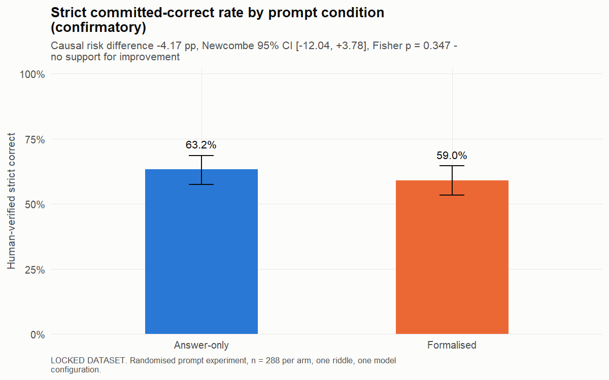
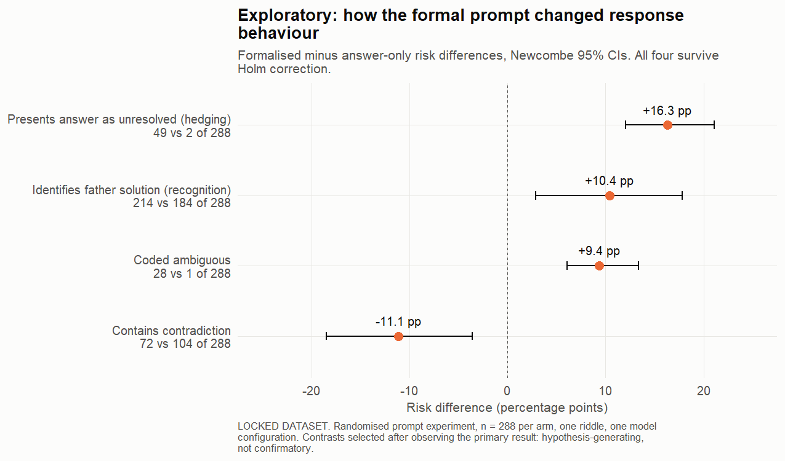
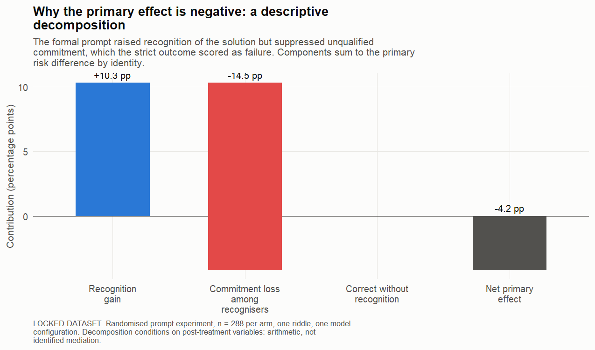
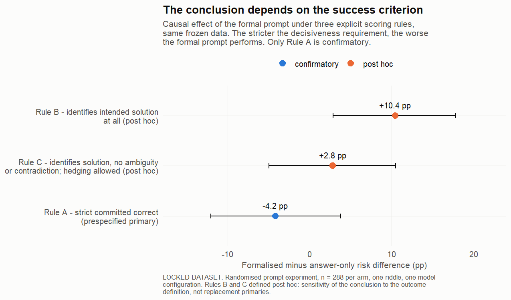
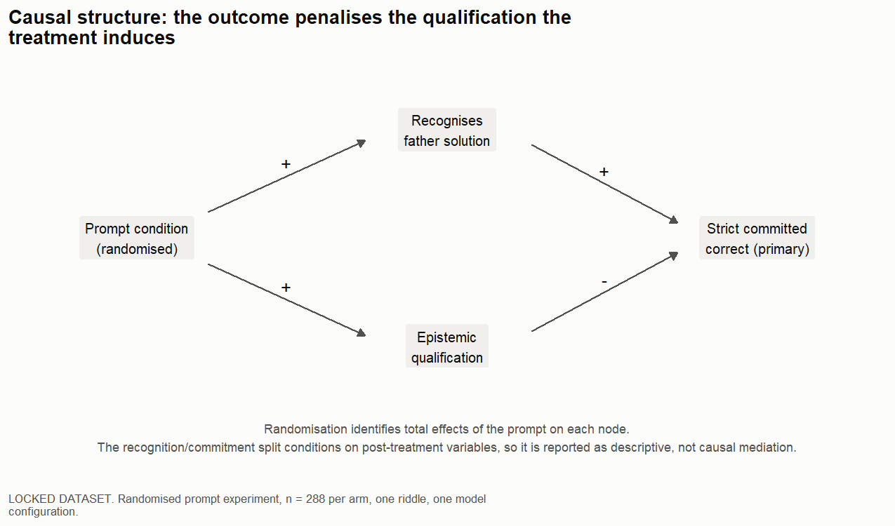

# Formal argument scaffolding in LLM responses

## A randomised model-output study with implications for Education AI Governance

This repository documents a randomised 576-response experiment and reproducible analysis of formal argument scaffolding on a bias-sensitive LLM task. The prompt did not improve the prespecified strict-correctness outcome. Exploratory diagnostics show a change in response behaviour that motivates, but does not confirm, a broader research programme.

For a concise overview of the study, findings, and education-governance relevance, read the [project summary](PROJECT_SUMMARY.md).

## Why this matters for Education AI Governance

Students are frequently told to check AI-generated work, yet “check it” is not an operational method. Formal critical thinking offers a teachable procedure:

1. State the proposed conclusion.
2. Separate facts from background knowledge and additional assumptions.
3. Identify the evidence supporting each premise.
4. Distinguish entailment from weaker support.
5. Test compatible alternatives and contradictions.

The formalised prompt turned that procedure into a response protocol. The experiment directly tests what happened to model outputs when the protocol was imposed. It does not test students.

The education hypothesis generated by the project is that students with training in argument structure, evidential support, inference classification, and entailment may be better able to construct and audit prompts of this kind. A future learner study must test whether that training improves prompt construction, error detection, calibration, and appropriate reliance.

| Project control | Education-governance relevance |
|---|---|
| Explicit premises and evidential bases | Critical AI literacy |
| Inference classification and alternative checks | Detection of unsupported reasoning |
| Coding by one reviewer blinded to condition | Human oversight |
| Frozen prompts, schedules, and outcome definitions | Change control |
| Stable identifiers and file hashes | Evidence integrity and traceability |
| Separate automated and human judgments | Accountability for evaluation decisions |
| Repair provenance | Deviation and incident documentation |
| Reproducible analysis | Auditability |

## Research question

Formal argument scaffolding asks a model to make each reasoning step inspectable. A response must state its conclusion, separate its premises, identify the evidence for each premise, classify its inferences, and consider alternatives. This structure could improve reasoning by exposing unsupported assumptions. It could also change how cautiously the model states its conclusion.

The experiment tested the following directional hypothesis:

> A formalised-argumentation prompt increases the rate of strict, human-verified correct answers relative to an answer-only prompt.

The prespecified directional hypothesis concerned the strict composite outcome. The blind-coded diagnostic variables also permit exploratory causal estimates of how prompt assignment changed solution recognition, contradiction, ambiguity, and qualification within the experiment. Claims about other questions, models, learners, or applications require new studies.

## The task and exact prompts

Both conditions received the same riddle and question. The treatment changed the requested response structure.

### Shared riddle

> Nadia, a secondary-school teacher, and her wife Elena have one son, Sami. Elena works as a structural engineer. Both Elena and Nadia are in full time employment and do not have any other jobs. During an earthquake, she is killed while travelling with Sami, who survives and is taken to hospital. When the neonatal nurse arrives, they look at Sami and say: “The engineer who died was my son’s mother. This patient is my son.” How is this possible?

The intended answer used by the frozen scoring rule was that the neonatal nurse is Sami's father.

### Answer-only condition

The complete prompt is stored in [`prompts/answer_only.txt`](prompts/answer_only.txt). After the shared riddle, it asked:

```text
QUESTION:

What is the answer to this riddle?

Give your answer in exactly the following format:

FINAL ANSWER: [your answer]
```

### Formalised-argumentation condition

The complete prompt is stored in [`prompts/formalised_argumentation.txt`](prompts/formalised_argumentation.txt). It required five substantive elements before the final answer:

1. A proposed conclusion.
2. Numbered premises, each with an evidential basis, supporting evidence, and justification.
3. Numbered inferences, each classified as deductive entailment, defeasible support, or unsupported.
4. An assessment of compatible alternative answers.
5. One final answer marker.

<details>
<summary>Show the exact required response template</summary>

```text
FORMALISED ARGUMENT:

CONCLUSION:
[proposed conclusion]

PREMISES:

P1: [premise]
EVIDENTIAL BASIS: [explicitly stated / ordinary background knowledge / additional assumption]
SUPPORTING EVIDENCE: [specific evidence]
JUSTIFICATION: [why the evidence supports P1]

P2: [premise]
EVIDENTIAL BASIS: [explicitly stated / ordinary background knowledge / additional assumption]
SUPPORTING EVIDENCE: [specific evidence]
JUSTIFICATION: [why the evidence supports P2]

[Repeat the same structure for every additional premise.]

INFERENCES:

I1: [premise or premises] therefore [intermediate or final conclusion]
CLASSIFICATION: [deductive entailment / defeasible support / unsupported]
JUSTIFICATION: [why this classification applies]

[Repeat the same structure for every important inference.]

ALTERNATIVE ANSWER CHECK:
[alternative answer and assessment]

FINAL ANSWER: [your answer]
```

</details>

## Methodology

### 1. Design freeze

The experiment configuration, prompts, schedule, scoring rule, analysis plan, and private gold answer were frozen locally before the final collection. Hash records were used to detect later changes. These records were published retrospectively rather than registered with an independent service. The schedule seed was `2026072501`; the blinded-review seed was `2026072502`. The public design evidence is in [`design/`](design/).

The treatment variable was `prompt_condition`. Its two values were `answer_only` and `formalised_argumentation`.

### 2. Randomised collection

The model was queried 576 times on 25 July 2026 through the OpenAI Responses API under a seeded, randomised call order. Each condition received 288 calls. The requested and returned model identifier was `gpt-5.6-luna`, with low reasoning effort and no system instruction. The configured maximum output was 2,000 tokens. Future access to that dated model identifier is not guaranteed, so exact regeneration may depend on provider availability.

Random assignment makes the between-condition contrast a causal estimate of the prompt's effect for this riddle, model, reasoning setting, and collection environment. Repeated calls estimate variability in the model's outputs. They do not create variation across questions.

### 3. Differential truncation and repair

Twenty-seven formalised responses reached an incomplete terminal state because the structured answers could exceed the original output limit. No answer-only response had this problem. Those 27 responses were recollected through a separate repair workflow with fresh repair response IDs and a 4,000-token limit.

The original raw records were retained. Repair provenance is recorded in the public dataset through fields such as `response_repair_applied`, `repair_response_id`, and `original_request_status`.

This repair is a design limitation because it affected one condition only. A sensitivity analysis excludes all 27 repaired responses and their paired answer-only responses. The remaining 261 pairs still show a negative formalised-minus-answer-only difference of -1.9 percentage points.

The same 261-pair exclusion was applied to the exploratory diagnostics. The recognition difference was +13.0 points and the contradiction difference was -13.4 points; the qualification and ambiguity increases also remained. Full counts and intervals are in [`results/exploratory_diagnostics.json`](results/exploratory_diagnostics.json). This sensitivity reduces concern that the diagnostic pattern was concentrated in repaired outputs, but it does not remove the post hoc status of those outcomes or the original condition-specific collection problem.

### 4. Parsing

The parser created one response-level row for every scheduled response ID. It extracted the final-answer marker and formal structure, then stored automated judgments in columns ending `_auto`.

Formal responses were also parsed into premise-level and inference-level records during the private research workflow. The GitHub dataset keeps the response-level variables needed to reproduce the published analyses.

### 5. Blinded human verification

Each response was presented under an opaque review-row identifier. The reviewer-facing workbook omitted prompt condition and response ID. One reviewer completed the coding. Human codes were joined back to experimental records only after review through a private linkage file. The frozen protocol and public variable codebook are in [`design/`](design/).

The reviewer coded whether the response identified the father solution, remained ambiguous, contradicted itself, or presented the answer as an unresolved possibility. The reviewer also applied the frozen strict-correctness rule. Human judgments appear in columns ending `_human`; automated fields remain separate.

All 576 rows have `Complete` review status. Nine responses changed after truncation repair and were coded against the complete repaired answers. Their public note text was corrected on 1 August 2026 because an earlier reconciliation instruction remained after completion; no judgment changed. See [`data/RELEASE_NOTES.md`](data/RELEASE_NOTES.md). The public dataset omits `review_row_id`, which protects the blinded linkage.

### 6. Primary outcome

`auditable_correct_answer_human` equals 1 when a response satisfies every part of the frozen rule:

1. It contains one usable final answer.
2. It clearly identifies the neonatal nurse as Sami's father.
3. It does not give an ambiguous answer.
4. It does not contradict its own conclusion.
5. It does not leave fatherhood as an unresolved possibility.

This outcome measures strict committed correctness. It combines answer recognition with decisiveness and internal consistency.

Despite the legacy variable name, it does not measure whether a human can audit the reasoning. Human auditability requires a separate reviewer-performance experiment.

### 7. Statistical analysis

The primary comparison subtracts the answer-only correct rate from the formalised correct rate. The analysis reports a risk difference, a Newcombe confidence interval, and a two-sided Fisher exact test. The frozen plan also defined equivalence margins of 10 and 5 percentage points.

The exploratory family contains four response diagnostics. Their p-values use Holm adjustment, which limits the chance of obtaining a small adjusted p-value simply because several related tests were examined.

The recognition and commitment decomposition is descriptive arithmetic. It conditions on recognition, which occurs after prompt assignment. The decomposition therefore explains where the observed difference appears in these data; it does not identify recognition as a causal mediator.

### 8. Linear probability model

A linear probability model expresses the treatment effect in percentage points:

$$
Y_i = \alpha + \tau T_i + \varepsilon_i
$$

Each response is indexed by $i$. The outcome $Y_i$ equals 1 when the response satisfies the rule being studied and 0 otherwise. The treatment indicator $T_i$ equals 1 for the formalised prompt and 0 for the answer-only prompt. The intercept $\alpha$ is the answer-only rate. The coefficient $\tau$ is the formalised rate minus the answer-only rate.

Random assignment gives $\tau$ a causal interpretation for this riddle and model configuration. HC2 robust standard errors account for the fact that a binary outcome has different variability at different probabilities.

| Outcome | Estimated $\tau$ | Robust 95% interval | Regression p-value | Status |
|---|---:|---:|---:|---|
| Strict committed correctness | -4.2 points | -12.1 to +3.8 | 0.305 | Confirmatory outcome; supporting regression |
| Identifies father solution | +10.4 points | +2.9 to +17.9 | 0.007, Holm-adjusted | Exploratory |
| Contains contradiction | -11.1 points | -18.6 to -3.6 | 0.007, Holm-adjusted | Exploratory |
| Leaves answer unresolved | +16.3 points | +11.9 to +20.8 | <0.001, Holm-adjusted | Exploratory |
| Coded ambiguous | +9.4 points | +5.9 to +12.9 | <0.001, Holm-adjusted | Exploratory |

The Newcombe interval and Fisher exact test remain the frozen primary analysis for strict correctness. The regression reaches the same substantive conclusion and gives a direct percentage-point interpretation. The complete model output is stored in [`results/lpm_results.csv`](results/lpm_results.csv).

## Results at a glance

The formalised prompt did not improve the strict outcome defined above. The exploratory response codes show that it changed other aspects of the model's behaviour.

| Result | Answer-only | Formalised | Formalised minus answer-only | Status |
|---|---:|---:|---:|---|
| Strict correct answer | 182/288 (63.2%) | 170/288 (59.0%) | -4.2 percentage points | Confirmatory |
| Identifies the intended solution | 184/288 (63.9%) | 214/288 (74.3%) | +10.4 percentage points | Exploratory |
| Contains a contradiction | 104/288 (36.1%) | 72/288 (25.0%) | -11.1 percentage points | Exploratory |
| Leaves the answer as an unresolved possibility | 2/288 (0.7%) | 49/288 (17.0%) | +16.3 percentage points | Exploratory |

The confirmatory outcome was fixed before collection. The exploratory contrasts were selected after the primary result was known, although the underlying response codes were collected during blinded review. Their role is hypothesis generation.



## What each result supports

| Evidence | Inference supported by that evidence | Boundary of the inference |
|---|---|---|
| 170/288 strict successes under formalisation and 182/288 under answer-only | The formalised prompt did not improve strict correctness in the observed setting | The data concern one riddle and one model configuration |
| Randomised assignment under the frozen schedule | The condition difference can be attributed to the prompt within this setting | Randomisation does not establish generalisation to other tasks |
| Newcombe 95% interval from -12.0 to +3.8 points | Sampling uncertainty includes a modest benefit and a larger disadvantage | The interval does not prove that every value inside it is equally likely |
| 214 versus 184 father identifications | The formal prompt increased solution recognition in an exploratory analysis | This outcome was promoted for analysis after the primary result was seen |
| 49 versus 2 unresolved-possibility codes | The formal prompt greatly increased qualification in these responses | The code does not establish whether that qualification was logically correct |
| The riddle permits a plausible compatibility objection | The frozen outcome may mix correctness with decisiveness | Independent item adjudication is needed to establish entailment status |
| Formal output fields were successfully parsed | The treatment changed response structure as intended | Structural compliance does not establish semantic validity or human auditability |

## Statistical terms in plain language

**Condition or arm.** One version of the experiment. Here, one arm received the answer-only prompt and the other received the formalised prompt.

**Correct rate.** The share of responses coded 1 under a stated rule. A rate of 59.0% means that 170 of 288 formalised responses satisfied the strict rule.

**Percentage point.** A direct difference between two percentages. The change from 63.2% to 59.0% is -4.2 percentage points.

**Risk difference.** The formal name for the difference between two outcome rates. In this repository it is always formalised minus answer-only.

**95% confidence interval.** A range produced by a procedure that captures the true effect in 95% of repeated experiments under its assumptions. The observed interval, -12.0 to +3.8 points, shows that the data remain compatible with effects on both sides of zero.

**p-value.** The probability of seeing a difference at least this extreme if the conditions truly had the same success probability and the test assumptions held. The confirmatory Fisher p-value is 0.347. This value does not measure the probability that the hypothesis is true.

**Null result.** A result that does not provide sufficient evidence for the proposed effect. A null result can still narrow plausible effect sizes and reveal design problems.

**Equivalence test.** A test asking whether the effect is small enough to count as practically similar. The 90% interval extended slightly beyond the prespecified 10-point boundary, so this study did not establish equivalence.

**Confirmatory analysis.** An analysis whose outcome and method were fixed before results were observed. The strict-correctness comparison is confirmatory.

**Exploratory analysis.** An analysis chosen after some results were known. It can reveal useful patterns and generate hypotheses, but it requires new data for a clean confirmatory test.

**Holm adjustment.** A correction applied when several hypotheses are tested together. It raises the evidential threshold so that a family of tests does not produce misleadingly small p-values through repeated searching.

**Causal effect.** The change produced by assigning one prompt rather than the other. Randomisation supports this interpretation for the fixed study setting.

**Generalisation.** The extension of a result to new questions, models, or settings. This experiment contains one question, so it does not estimate item-to-item variation.

## Findings

### Confirmatory result

The formalised condition produced 170 strict successes from 288 responses. The answer-only condition produced 182 from 288. The risk difference was -4.17 percentage points (Newcombe 95% CI -12.04 to +3.78; Fisher exact p = 0.347).

The result provides no evidence that formalisation improved strict correctness. The 90% interval was -10.79 to +2.51 points, so equivalence within the prespecified 10-point margin was also not established.

### Exploratory behavioural pattern

The formal prompt increased father-solution identification by 10.4 points and reduced contradiction by 11.1 points, while also increasing unresolved-possibility language by 16.3 points and ambiguity by 9.4 points. These are prompt effects within the fixed experimental setting, but the outcomes were selected for analysis after the primary result was known. All four contrasts were defined as one exploratory family and adjusted with the Holm method; they require confirmation on fresh data.

The arithmetic decomposition assigns +10.3 points to increased recognition and -14.5 points to lower commitment among recognisers. These components sum to the -4.2-point primary difference. The decomposition describes the observed joint distribution; it does not establish a mediation pathway.





### Outcome-definition sensitivity

Three rules were applied to the same frozen responses:

| Rule | What counts as success | Estimated effect | Status |
|---|---|---:|---|
| A | Strict committed correctness | -4.2 points | Prespecified primary |
| C | Recognition without ambiguity or contradiction; qualification allowed | +2.8 points | Post hoc |
| B | Mentions the father solution | +10.4 points | Post hoc |

The result changes as the scoring rule demands more commitment. Rule A remains the confirmatory result because it was frozen before collection. [`docs/05_outcome_definition_sensitivity.md`](docs/05_outcome_definition_sensitivity.md) explains the trade-offs.



## Construct validity

The riddle asks how the nurse's statement is possible. The frozen outcome requires the model to select fatherhood decisively. Fatherhood is compatible with the stated facts, while unique entailment remains contestable because other family arrangements may also satisfy the wording.

The formal prompt explicitly asks whether alternatives remain compatible. A careful response may therefore identify the intended father answer and still qualify it. The primary outcome scores that response 0.

This tension does not justify changing the primary result. It identifies a measurement problem for the next experiment. Independent adjudication should classify each future item as uniquely entailed or underdetermined before collection.



## Evaluation: why use a bias-sensitive riddle?

The study adapts the structure of the classic surgeon riddle:

> A father and his son are involved in a serious car crash. The father dies. The son is taken to hospital for emergency surgery. The surgeon looks at the boy and says, “I cannot operate on him; he is my son.” How is this possible?

The conventional answer is that the surgeon is the boy's mother. The puzzle is difficult when a reader automatically associates surgeons with men and then tries to repair the story through unsupported assumptions. Experimental research has used surgeon and specialist versions of this riddle to study gendered mental representations of professional roles ([Hansen et al., 2018](https://doi.org/10.3389/fpsyg.2018.00985)). Separate research has found gender and racial patterns in LLM evaluations of medical professionals, including surgical specialties ([Chen et al., 2024](https://arxiv.org/abs/2407.12031)).

This experiment does not directly estimate demographic bias. It adapts the riddle mechanism as a stress test for heuristic completion. The modified prompt supplies several cues that can compete with the literal constraints: a familiar parent-and-medical-professional structure, gendered family information, and occupations associated with social stereotypes. An LLM may follow a familiar narrative template, import an unstated family role, or overlook the statement that Nadia and Elena have no other jobs. In this setting, hallucination means adding an unsupported person, occupation, or family relationship to make the story fit a familiar pattern.

That sensitivity made the item useful for testing formal argument scaffolding. A structured response can display which facts were used and whether a conclusion is presented as entailed or merely compatible. In exploratory analyses, formalisation increased identification of the intended solution and reduced contradiction, but it also increased ambiguity and unresolved qualification. This experiment did not test whether people could audit the structured responses more successfully.

The same item also created the study's central measurement problem. The question asks how the statement is possible, while the strict outcome demands an unqualified father conclusion. A formal response that identifies fatherhood and then observes that other arrangements remain logically possible receives a score of 0. The scoring rule therefore had limited capacity to reward solution recognition, contradiction reduction, explicit assumption tracking, or calibrated uncertainty.

The primary result still answers the frozen question about strict committed correctness. The wider evaluation suggests that this criterion was too narrow for a bias-sensitive, potentially underdetermined riddle. A stronger replication should retain the stress-test logic while measuring recognition, contradiction avoidance, assumption control, and calibration as separate prespecified outcomes.

## Data

The public response-level dataset is [`data/responses_with_locked_human_verification_public.csv`](data/responses_with_locked_human_verification_public.csv).

- Rows: 576
- Conditions: 288 answer-only and 288 formalised
- Public SHA-256: `f1f74c1877f5e79b576ed96233aec619ae26162e8a07def76556110f432c92d5`
- Private locked SHA-256: `e1a15f7898cf1885ec69e24c718f768d27ad7844e02ba54101dc3a1f3e720e7e`

The public release omits `review_row_id`, which links responses to the blinded coding workbook. It also corrects nine stale reviewer-note instructions without changing any judgment; the previous and current hashes are recorded in [`data/RELEASE_NOTES.md`](data/RELEASE_NOTES.md). The analysis scripts reconcile every published outcome count against [`data/final_analysis_statistics.json`](data/final_analysis_statistics.json).

The dataset contains complete model outputs. It also contains collection metadata, parser outputs, repair provenance, and human judgments. Column suffixes identify provenance: `_auto` means deterministic parser output, while `_human` means blinded human coding.

## Reproducing the analysis

### Fast integrity check

This command uses only the Python standard library. It verifies the public dataset hash, exact prompt hashes, row counts, unique response IDs, condition balance, review completion, and frozen primary counts.

```bash
python analysis/verify_repository.py
```

The same command runs automatically through GitHub Actions on every push and pull request.

### R pipeline

The project records R 4.6.1 and exact package versions in [`renv.lock`](renv.lock). Restore them once from the repository root:

```r
install.packages("renv")
renv::restore()
```

Run the committed public dataset:

```bash
Rscript --vanilla analysis/run_study1_locked.R data/responses_with_locked_human_verification_public.csv
```

Run the synthetic validation path without using the response dataset:

```bash
Rscript --vanilla analysis/run_study1_locked.R
```

The R script checks arm sizes and frozen counts before analysis. It verifies the primary risk difference and confidence interval to machine precision before producing figures or result files.

Run the dependency-free linear probability models:

```bash
Rscript --vanilla analysis/linear_probability_models.R
```

This command writes `results/lpm_results.csv`. It uses base R and calculates HC2 robust standard errors directly.

### Python cross-check

Create an environment and install the exact dependency set:

```bash
python -m venv .venv
python -m pip install -r requirements-lock.txt
```

[`requirements.txt`](requirements.txt) pins the two direct dependencies. [`requirements-lock.txt`](requirements-lock.txt) also records their transitive dependencies for exact reproduction.

Run the exploratory cross-check:

```bash
python analysis/exploratory_diagnostics.py \
  --dataset data/responses_with_locked_human_verification_public.csv \
  --out results/exploratory_diagnostics.json
```

The Python script recognises the documented hashes for both the private locked dataset and the public copy. An unexpected hash stops the run.

## Repository map

```text
analysis/       R analysis and Python cross-check
data/           public response data, release notes, and frozen statistics
design/         locally frozen plan, review protocol, schedule, and provenance
docs/           analysis status, sensitivity work, and follow-up designs
figures/        figures generated from the locked analysis
prompts/        exact treatment and control prompts
results/        machine-readable analysis outputs
.github/        automatic integrity check for pushes and pull requests
renv.lock       exact R environment
```

The most useful supporting documents are:

- [`docs/01_interpretation_boundaries.md`](docs/01_interpretation_boundaries.md), which states what the experiment does and does not support.
- [`docs/02_exploratory_reanalysis_spec.md`](docs/02_exploratory_reanalysis_spec.md), which declares the exploratory contrast family.
- [`docs/03_preregistration_draft.md`](docs/03_preregistration_draft.md), which proposes a multi-item replication with separated outcomes.
- [`docs/04_auditability_study_design.md`](docs/04_auditability_study_design.md), which tests whether structure helps human reviewers detect reasoning defects.
- [`docs/05_outcome_definition_sensitivity.md`](docs/05_outcome_definition_sensitivity.md), which compares three explicit scoring rules.

## Limitations

The study uses one riddle, one model, and one reasoning-effort setting. Repeated generations improve precision for that fixed configuration; they do not support broad claims about reasoning tasks.

All 27 incomplete outputs occurred in the formalised condition. Separate repair calls preserved the original records and solved the missing-final-answer problem, while introducing a condition-specific intervention.

The outcome combines recognition with decisive commitment. Its validity depends on whether the father answer is uniquely entailed. That status remains an open adjudication question.

One reviewer, blinded to prompt condition, completed the final accuracy coding. The study therefore cannot estimate inter-rater reliability. A replication should use two independent reviewers and report agreement before adjudication.

Automated structural compliance shows that required sections were present. It does not show that every premise and inference was logically sound. A dedicated semantic audit remains future work.

## Research commitments

The locked dataset, primary outcome, and confirmatory result remain fixed. Exploratory analyses carry an explicit label. The recognition gain is reported together with the qualification increase. Future hypotheses generated here require fresh data.

These commitments protect the distinction between learning from an unexpected result and rewriting the experiment around it.

## Next studies

The immediate priority is independent adjudication of the riddle's entailment status. The proposed replication then tests many items whose epistemic status is established in advance. It treats recognition, commitment, and calibration as separate outcomes.

The auditability study addresses the project's practical question directly: do structured responses help human reviewers find and localise reasoning defects? Its outcome concerns reviewer performance rather than model accuracy.

## Author and licence

Rohan Neelala, BA Philosophy, Politics and Economics, University of Warwick.

The code and original repository documentation are released under the [MIT License](LICENSE). Dataset permissions and third-party model-output limitations are stated separately in [`DATA_LICENSE.md`](DATA_LICENSE.md).

GitHub can generate a citation from [`CITATION.cff`](CITATION.cff).
